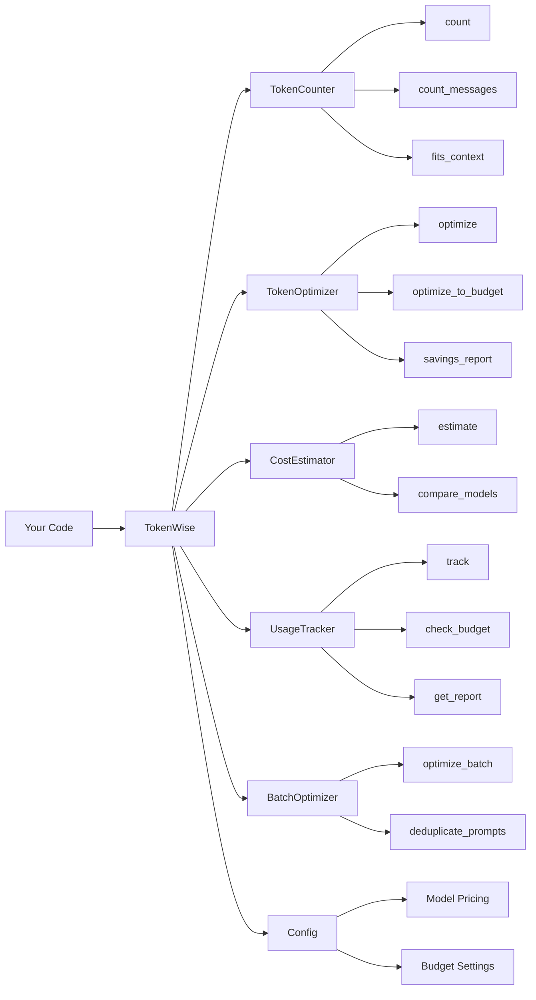

# TokenWise

[](https://github.com/MukundaKatta/TokenWise/actions/workflows/ci.yml)
[](https://www.python.org/downloads/)
[](LICENSE)
[](https://github.com/psf/black)

**Token usage optimization toolkit** — count tokens, compress prompts, estimate API costs, and track LLM token budgets. Works with GPT-4, Claude, Llama, Gemini, Mistral, and more.

---

## Why TokenWise

Token cost and context-window limits show up everywhere in modern AI systems, but most teams still handle them with scattered scripts, rough estimates, and provider-specific logic.

TokenWise is designed to make those concerns easier to manage in one place:

- estimate token usage before a request goes out
- compare cost across model families
- compress prompts when budgets are tight
- track spend over time instead of treating cost as an afterthought

## What It Covers

- token counting heuristics across major model families
- prompt optimization and budget-aware trimming
- cost estimation for input and output tokens
- usage tracking with alerts and reporting
- batch prompt cleanup workflows

## Architecture



## Quickstart

### Installation

```bash
pip install tokenwise
```

Or install from source:

```bash
git clone https://github.com/MukundaKatta/TokenWise.git
cd TokenWise
pip install -e .
```

### Basic Usage

```python
from tokenwise import TokenCounter, TokenOptimizer, CostEstimator, UsageTracker

# Count tokens
counter = TokenCounter()
tokens = counter.count("Hello, how can I help you today?", model="gpt-4")
print(f"Token count: {tokens}")

# Estimate cost
estimator = CostEstimator()
cost = estimator.estimate(tokens, model="gpt-4")
print(f"Estimated cost: ${cost:.6f}")

# Optimize a prompt
optimizer = TokenOptimizer()
report = optimizer.savings_report(
    "Please kindly just basically explain what AI actually is in my opinion."
)
print(f"Saved {report['tokens_saved']} tokens ({report['savings_pct']}%)")

# Track usage with budget alerts
tracker = UsageTracker()
tracker.track(
    request="Explain quantum computing in simple terms.",
    response="Quantum computing uses qubits instead of classical bits..."
)
print(f"Total spend: ${tracker.total_cost():.6f}")
```

### Multi-step Budget Breakdown

```python
from tokenwise import BudgetTracker

tracker = BudgetTracker()
tracker.add_step("draft", request="Write a landing page headline", response="Fast AI workflows for teams.")
tracker.add_step("review", request="Critique the headline", response="Shorten the second clause.")

report = tracker.get_report(warning_threshold_usd=0.01)
print(report.total_cost)
print(report.pricing_version)
for step in report.steps:
    print(step.name, step.total_tokens, step.total_cost)
```

### CLI

```bash
# Count tokens
tokenwise count "Hello, how can I help you today?"

# Estimate cost
tokenwise cost "Hello, how can I help you today?" --model gpt-4

# Compare costs across all models
tokenwise cost "Hello, how can I help you today?" --compare

# Optimize a prompt
tokenwise optimize "Please kindly just basically explain what AI is."
```

### Batch Optimization

```python
from tokenwise import BatchOptimizer

batch = BatchOptimizer()
prompts = [
    "Please kindly explain AI.",
    "In order to understand, basically describe ML.",
    "Please kindly explain AI.",  # duplicate
]

# Deduplicate
unique = batch.deduplicate_prompts(prompts)

# Optimize and get summary
summary = batch.batch_summary(unique)
print(f"Saved {summary['total_tokens_saved']} tokens across {summary['prompt_count']} prompts")
```

## Pricing Data

Model pricing now lives in a versioned package data file at `src/tokenwise/data/model_pricing.v1.json`.

That gives TokenWise a safer update workflow:

- pricing changes are separated from estimator logic
- the catalog carries an explicit version
- historical reports can point back to the pricing version used at the time

To update pricing, edit the JSON catalog, keep the schema consistent, and run the test suite before publishing.

## Pricing Table

| Model | Input (per 1K tokens) | Output (per 1K tokens) |
|-------|----------------------|------------------------|
| GPT-4 | $0.0300 | $0.0600 |
| GPT-4 Turbo | $0.0100 | $0.0300 |
| GPT-4o | $0.0050 | $0.0150 |
| GPT-3.5 Turbo | $0.0005 | $0.0015 |
| Claude 3 Opus | $0.0150 | $0.0750 |
| Claude 3.5 Sonnet | $0.0030 | $0.0150 |
| Claude 3 Haiku | $0.00025 | $0.00125 |
| Claude 4 Opus | $0.0150 | $0.0750 |
| Claude 4 Sonnet | $0.0030 | $0.0150 |
| Gemini 1.5 Pro | $0.00125 | $0.0050 |
| Gemini 1.5 Flash | $0.000075 | $0.0003 |
| Llama 3 70B | $0.00059 | $0.00079 |
| Llama 3 8B | $0.00005 | $0.00008 |
| Mistral Large | $0.0040 | $0.0120 |
| Mistral Small | $0.0010 | $0.0030 |

## Features

- **Token Counting** — Heuristic-based token estimation for all major LLM models
- **Prompt Optimization** — Compress prompts by removing filler words and shortening verbose phrases
- **Cost Estimation** — Up-to-date pricing for GPT-4, Claude, Gemini, Llama, Mistral, and more
- **Usage Tracking** — Track token usage with daily/monthly budgets and threshold alerts
- **Batch Optimization** — Optimize and deduplicate lists of prompts in bulk
- **CLI** — Built-in command-line interface powered by Typer and Rich
- **Model Comparison** — Compare token counts and costs across models side-by-side

## Who This Is For

- developers building AI products with real token budgets
- teams comparing providers and model cost tradeoffs
- prompt engineers trying to reduce waste without losing clarity
- anyone who wants lightweight token tooling without a larger framework

## Configuration

Set defaults via environment variables or `.env` file:

```bash
TOKENWISE_DEFAULT_MODEL=gpt-4
TOKENWISE_LOG_LEVEL=INFO
TOKENWISE_COST_MULTIPLIER=1.0
```

See [.env.example](.env.example) for all available options.

## Development

```bash
make dev       # Install with dev dependencies
make test      # Run tests
make lint      # Lint with ruff
make format    # Auto-format code
make run       # Show CLI help
```

## Project Direction

TokenWise is best when it stays practical: easy to script, easy to embed in existing apps, and focused on the real questions developers ask when shipping LLM-powered systems.

Future improvements can build on that foundation with:

- better model-pricing refresh workflows
- more benchmark-style prompt comparisons
- richer reporting and budget policy options
- stronger integration patterns for production AI pipelines

## License

MIT License. See [LICENSE](LICENSE) for details.

---

*Inspired by LLM cost optimization trends and the need for better token management*

---

Built by Officethree Technologies | Made with ❤️ and AI
